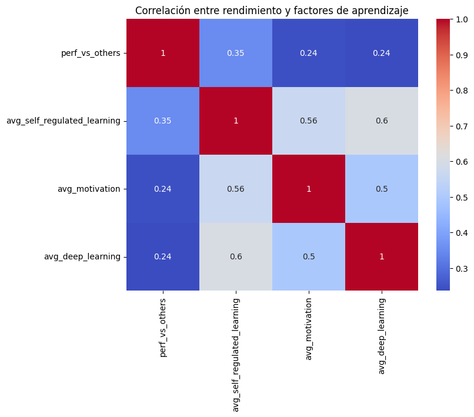
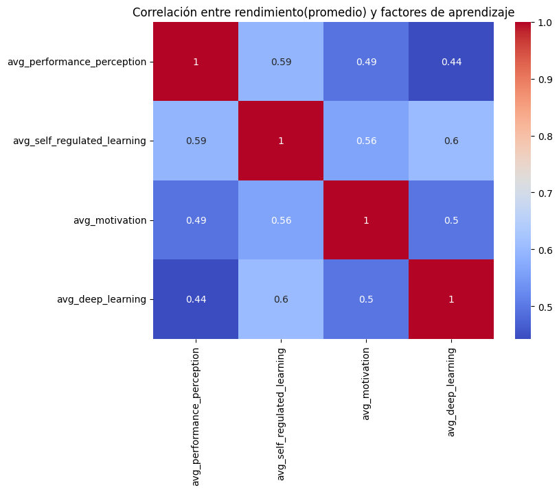

# Notas del proyecto

Las siguientes notas son mis apuntes personales del proyecto, las cuales me ayudaron a entender, organizar y estructurar mis ideas durante el desarrollo de este. 

**Nombre del proyecto:** Estrategias de aprendizaje y su relación con el rendimiento.

**Categoría:** Educación y aprendizaje 

**Preguntas guía (foco):** 
- ¿Qué variables tienen mayor correlación con el rendimiento académico?
- ¿Cuáles son los predictores más fuertes de buen desempeño académico?

**Motivación:** Analizar cómo diferentes estrategias de estudio o motivaciones internas se relacionan con el rendimiento o satisfacción.

**Dataset:** Después de una busqueda a través de diferentes datasets se seleccionó el siguiente: 

- _Learning Strategies in Higher Education_

- **Descripción:** 
    Este conjunto de datos presenta los resultados numéricos de un proyecto de investigación destinado a evaluar las habilidades de aprendizaje autorregulado en estudiantes universitarios.La escala aplicada mide **cuatro dimensiones** clave de las estrategias de aprendizaje: 

    1. Percepción del rendimiento académico 
    2. Autogestión del aprendizaje 
    3. Estrategias de motivación consciente para el aprendizaje
    4. Técnicas de aprendizaje profundo. 

    Los datos se recopilaron en **Chile y Ecuador**, lo que proporciona información valiosa sobre las capacidades de aprendizaje autorregulado de los estudiantes universitarios en el contexto latinoamericano.

- **Fuente:** Mendeley (Chile & Ecuador)

- **Fecha de publicación:** 21 Julio 2025

- **URL:** https://data.mendeley.com/datasets/7vgyndhb87/5

- **Cita completa:** Ramos-Galarza, Carlos; Obregón, Jennifer; Lepe-Martínez, Nancy; Del Valle, Milenko (2025), “Learning Strategies in Higher Education: A Research Dataset”, Mendeley Data, V5, doi: 10.17632/7vgyndhb87.5


## Mapeo de columnas del dataset con factores del cuestionario

El documento _GAEU-1 Scale Questionnaire_ indica que los ítems (GA1 a GA19) se agrupan así:

|Factor|	Items relacionados|
|------|-----------------------|
|Academic performance perception _(Percepción del rendimiento académico)_|	GA1, GA5, GA12, GA15|
|Self-Regulated Learning _(Autogestión del aprendizaje)_|	GA2, GA3, GA4, GA6, GA13, GA14|
|Conscious learning motivation strategies _(Estrategias de motivación consciente para el aprendizaje)_|	GA7, GA8, GA9, GA10, GA11|
|Deep learning techniques (_Técnicas de aprendizaje profundo_)|	GA16, GA17, GA18, GA19|

Con esto se renombraron a los items para que tuvieran un nombre más descriptivo 
```
    'GA1': 'perf_vs_others',
    'GA2': 'prep_materials',
    'GA3': 'study_space',
    'GA4': 'autonomous_learning',
    'GA5': 'perf_vs_grades',
    'GA6': 'academic_responsibility',
    'GA7': 'self_motivation_words',
    'GA8': 'motivation_difficulties',
    'GA9': 'optimism',
    'GA10': 'motivation_future',
    'GA11': 'positive_academic_outlook',
    'GA12': 'perf_satisfaction',
    'GA13': 'time_management',
    'GA14': 'problem_solving',
    'GA15': 'learn_ability',
    'GA16': 'deep_techniques_1',
    'GA17': 'deep_techniques_2',
    'GA18': 'deep_techniques_3',
    'GA19': 'deep_techniques_4',
```

### Matrices de correlación 
Se crearon columnas de promedio por factor para **resumir el comportamiento de ese factor como una sola variable** y facilitar el análisis estadistico.

|Factor asociado|Nombre de la columna|Items|
|-------|---------------------|--------------------|
|Percepción del rendimiento académico|avg_performance_perception | `'perf_vs_others', 'perf_vs_grades', 'perf_satisfaction', 'learn_ability'`|
|Autogestión del aprendizaje|avg_self_regulated_learning|`'prep_materials', 'study_space', 'autonomous_learning', 'academic_responsibility', 'time_management', 'problem_solving'`|
|Estrategias de motivación conciente para el aprendizaje|avg_motivation| `'self_motivation_words', 'motivation_difficulties', 'optimism', 'motivation_future', 'positive_academic_outlook'` |
|Técnicas de aprendizaje profundo|avg_deep_learning| `'deep_techniques_1', 'deep_techniques_2', 'deep_techniques_3', 'deep_techniques_4' ` |

Recordando que `perf_vs_others` es:

>  Considero que mi rendimiento académico es igual o mejor que el de mis compañeros.

Se van a mostrar las correlaciones de esta variable con los promedios de los otros factores 




Por lo que se tiene que: 

- La **autogestión del aprendizaje** (`avg_self_regulated_learning`) es el factor más correlacionado con el **rendimiento percibido en comparación con otros** (``perf_vs_others``). 

- `avg_motivation` y `avg_deep_learning` también ayudan, pero menos.

- `avg_self_regulated_learning` y `avg_deep_learning` están fuertemente relacionados (0.6).

- `avg_motivation` también se conecta con ambos (0.5–0.56), lo cual sugiere que estos estilos de aprendizaje se retroalimentan.


También se hizo la matriz de correlación entre `avg_performance_perception` para tener un panoráma más amplio del **rendimiento percibido en general**, obteniendo los siguientes resultados:




| Variable | Correlación | Nivel           |Primeras observaciones|
| ----------------------------------------- | ----------- | --------------- |------|
| `avg_self_regulated_learning`             | **0.59**    |  Moderada-fuerte | Cuanto más una persona organiza su espacio, su tiempo y se hace responsable de su aprendizaje, más tiende a evaluarse a sí misma como buena estudiante.|
| `avg_motivation`                          | 0.49        | Moderada        |Frases internas como “puedo hacerlo” o “tengo planes para el futuro” parecen estar ligadas a una percepción positiva del rendimiento.|
| `avg_deep_learning`                       | 0.44        | Moderada        |El uso de resúmenes, mapas conceptuales, lectura crítica, etc., está correlacionado con el rendimiento percibido, aunque menos que la autogestión|

En esta segunda matriz las correlaciones son más altas porque estás midiendo la **percepción general de rendimiento con más de un ítem**, lo que hace la señal más robusta.

Por lo que los datos muestran que los estudiantes que puntúan alto en estrategias de autogestión (como organizar su espacio, tiempo y asumir responsabilidades) también tienden a evaluarse como buenos estudiantes. Esta relación es más fuerte que la que existe con la motivación o el uso de técnicas profundas. Esto sugiere que, para mejorar el **rendimiento académico percibido**, intervenir en **habilidades de autogestión** puede ser más efectivo que enfocarse exclusivamente en motivación o técnicas de estudio.


